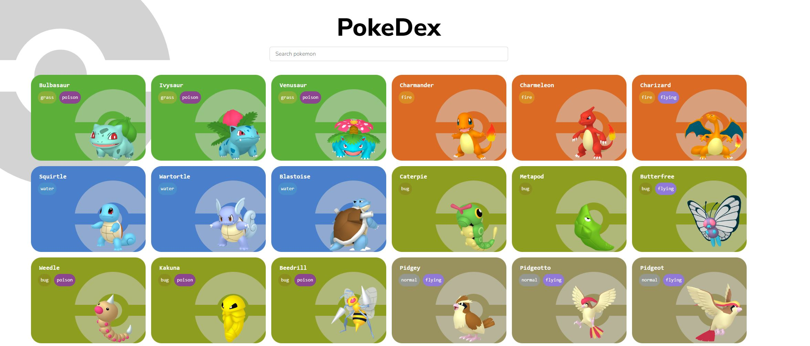
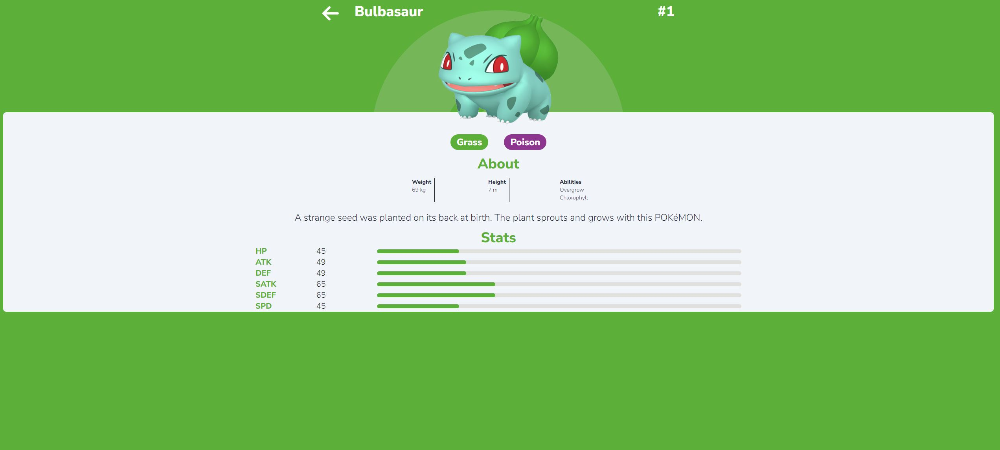

<div align="left">
  
  <h1>🔍 Pokedex</h1>
</div>


### 🎯 Project Overview

Pokedex is an interactive web application built using React.js that allows users to search and learn more about their favorite Pokemon. The application leverages the comprehensive [PokeAPI](https://pokeapi.co/) to fetch and display detailed information about each Pokemon, including their types, abilities, stats, and more.

Each Pokemon has a dedicated page with more detailed data, providing users with a deep dive into their favorite Pokemon's abilities. The search feature enhances the user experience by allowing quick and easy navigation to the Pokemon of interest.

---
## Screenshots

<div align="center">
  
  <h1> Pokemon List</h1>
</div>

<div align="center">
  
</div>

<div align="center">
  
  <h1>🔍 Pokemon Page</h1>
</div>

<div align="center">
  
</div>

### 🛠️ Built With

- [React.js](https://reactjs.org/)
- [Axios](https://axios-http.com/)
- [FontAwesome](https://fontawesome.com/)
- [React Top Loading Bar](https://www.npmjs.com/package/react-top-loading-bar)
- [React Transition Group](https://reactcommunity.org/react-transition-group/)
- [React Progress Bar](https://www.npmjs.com/package/@ramonak/react-progress-bar)
## Installation

To run the application locally, follow these steps:

1. Clone the repository.
    ```
    git clone https://github.com/GabrielStefan24/PokeDex.git
    ```
  

2. Install dependencies.
    ```
    cd PokeDex
    npm install
    ```

3. Start the development server.
    ```
    npm run dev
    ```

4. Open [http://localhost:3000](http://localhost:3000) in your browser.

## Contributing

Pull requests are welcome. For major changes, please open an issue first to discuss what you would like to change.

## Contact

[Email](mailto:sirbugabriel97@gmail.com)
